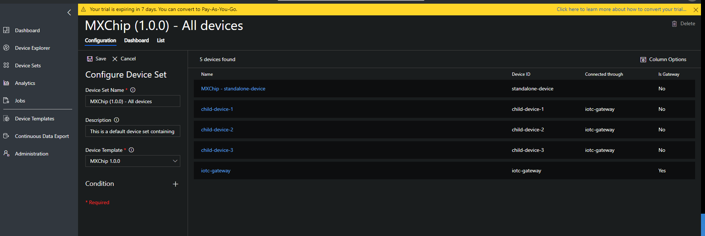

# Fork changes for Azure IoT Central Device Bridge to represent bridge as a gateway device within Azure IoT Central
The current fork has changes to enable Azure IoT Central Device Bridge to be represented in IoT Cental as a gateway.

## New Azure Iot Central features to display generic, transparent gateway devices  
With the latest changes in Azure IoT Central, users are able to see the parent-child relationship between the generic gateway device and child devices connected through a given gateway. 

During device registration, the device can register itself to have the following characteristics:
- Regular device connected directly to IoT Central
- Generic gateway device
- Device connected to IoT Central through the generic gateway. The device indicates its parent gateway device ID through which it is connected to

### Displaying device gateway information within Device Explorer and Device Sets
In order to view the gateway connection attributes within the Device Explorer or Device Sets pages, you can click "Column Options" to add the "Device Type" and "Connected to" column options.

Unassosiated gateway device
  

Unassociated Device connected to gateway
 

Associated devices view

Configure Device Set to display gateway related columns

### Search to display all devices connected to a given gateway
Full text search has been extended to search within deviceGatewayId represented as "Connected to" column in the Device Explorer.
You can see all child devices connected to a given gateway by entering gateway device ID within search input.

## Changes to the fork
See original documentation in Read.me of upstream branch for complete deployment instructions.

[azuredeploy.json](azuredeploy.json) has been modified to include 2 new parameters:

"iotCentralActAsGateway": {
            "type": "bool"
        },
        "iotCentralGatewayDeviceId": {
            "type": "String"
}
Act as Gateway is a boolean flag indicating if device bridge should register itself as a gateway within IotCentral. Set this flag to true otherwise solution will work as upstream branch.

 Gateway Device ID is a device ID which will represent the bridge as a gateway device within Azure IoT Central. 

 

## [lib/engine.js changes](IoTCIntegration\lib\engine.js)

A code block has been introduced to register the bridge as a gateway when the Azure Function receives it's first request. Please take note that none of subsequent requests will be proccessed until the bridge is assocciated with a Device Template in your IoT Central application.

if (context.actAsGateway) {
        if (!gatewayDevice) {
            gatewayDevice = { deviceId: context.gatewayDeviceId };
        }

        const gatewayClient = Device.Client.fromConnectionString(await getDeviceConnectionString(context, gatewayDevice), DeviceTransport.Http);
        try {
            await util.promisify(gatewayClient.open.bind(gatewayClient))();
            context.log('[HTTP] Sending telemetry for gateway device', gatewayDevice.deviceId);
            // TODO: add any gateway specific telemetry if needed
            // await util.promisify(gatewayClient.sendEvent.bind(gatewayClient))(new Device.Message(JSON.stringify({["ping"]:1})));
            await util.promisify(gatewayClient.close.bind(gatewayClient))();

        } catch (e) {
            // If the device was deleted, we remove its cached connection string
            if (e.name === 'DeviceNotFoundError' && deviceCache[gatewayDevice.deviceId]) {
                delete deviceCache[gatewayDevice.deviceId].connectionString;
            }
            throw new Error(`Unable to send telemetry for gateway device ${gatewayDevice.deviceId}: ${e.message}`);
        }

        device.gatewayId = gatewayDevice.deviceId;
    }
</code>
  
Device Provisioning Service api call has been changed to add ab extra post body information to indicate if the device is a gateway device or a child device connected to the gateway.

const bodyJson = {
        registrationId: deviceId
    };

    if (context.actAsGateway) {
        if (device.gatewayId) {
            bodyJson["data"] = {
                iotcGateway: {
                    iotcGatewayId: device.gatewayId,
                    iotcIsGateway: false
                }
            }
        } else {
            bodyJson["data"] = {
                iotcGateway: {
                    iotcGatewayId: null,
                    iotcIsGateway: true
                }
            }
        }
    }

    const registrationOptions = {
        url: `https://${registrationHost}/${context.idScope}/registrations/${deviceId}/register?api-version=${registrationApiVersion}`,
        method: 'PUT',
        json: true,
        headers: { Authorization: sasToken },
        body: bodyJson,
    };
